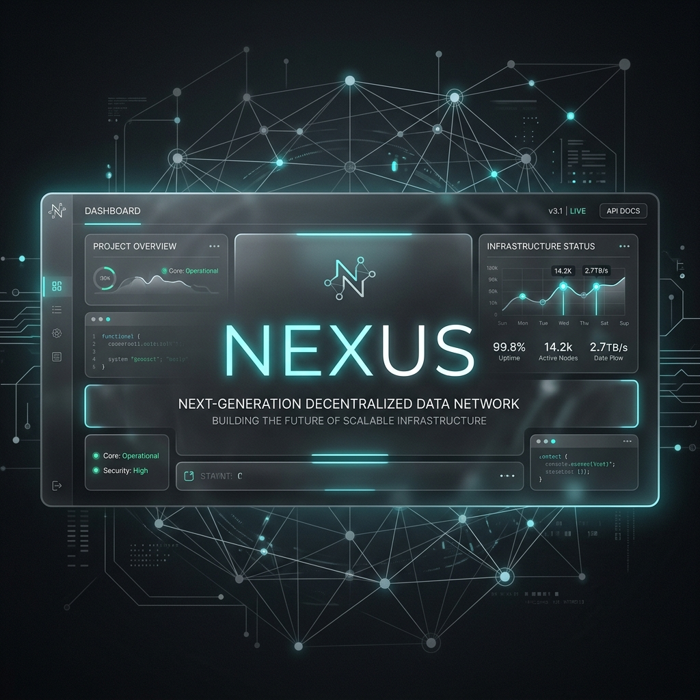
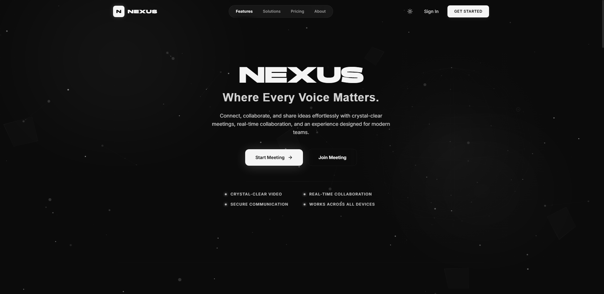
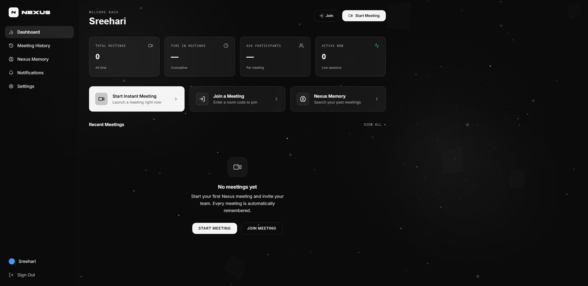
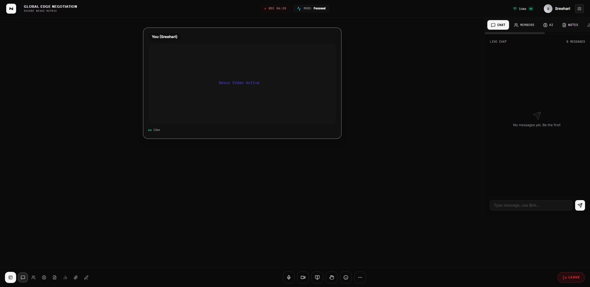
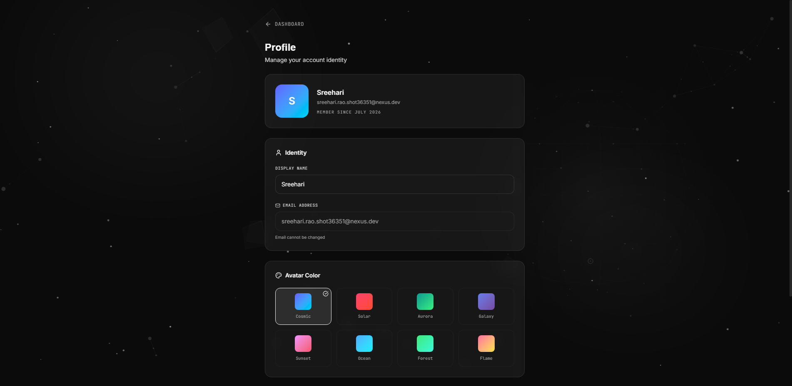
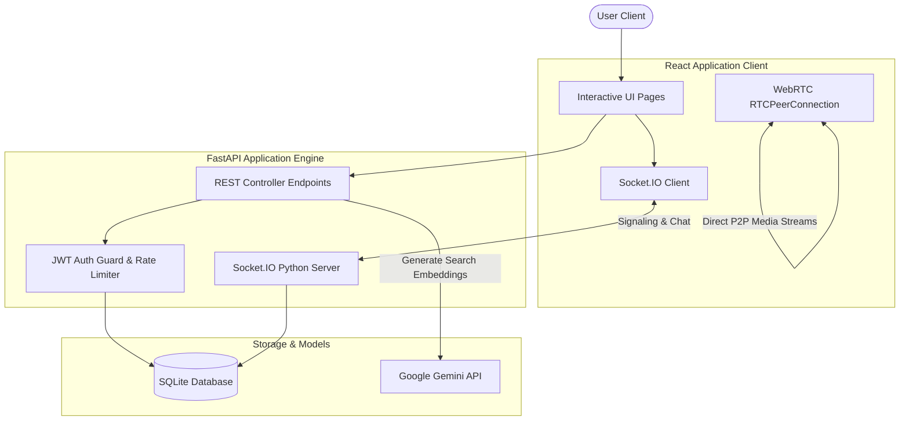
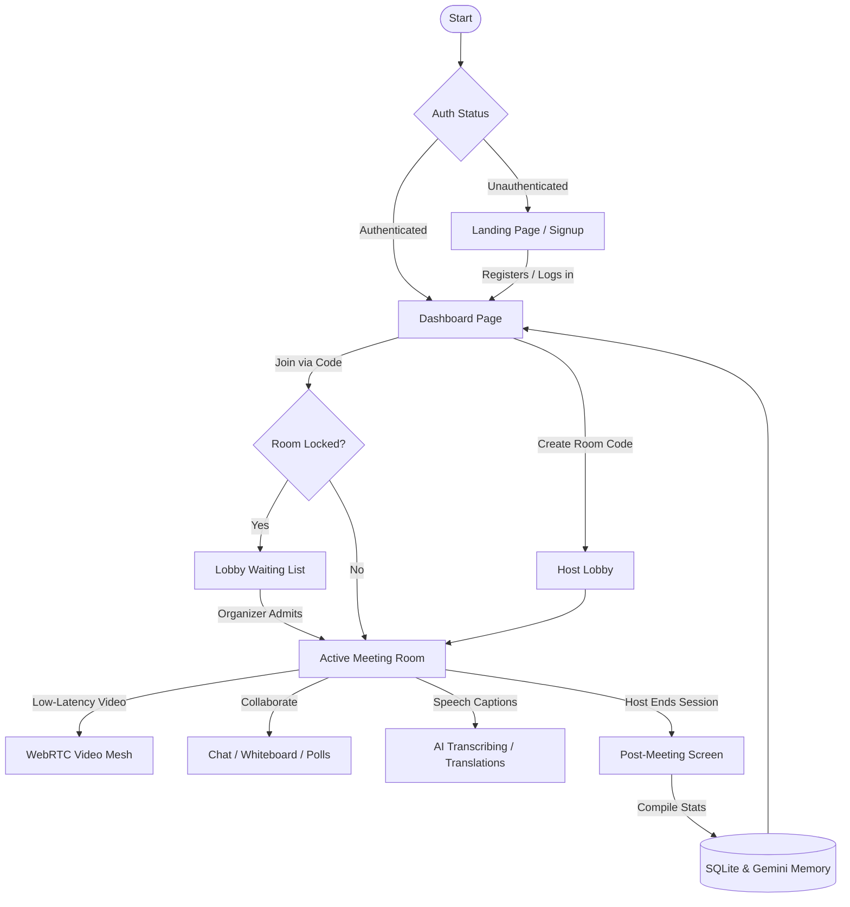
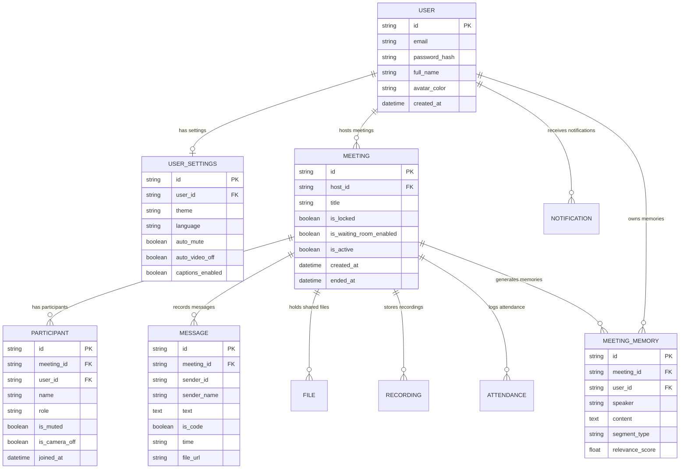
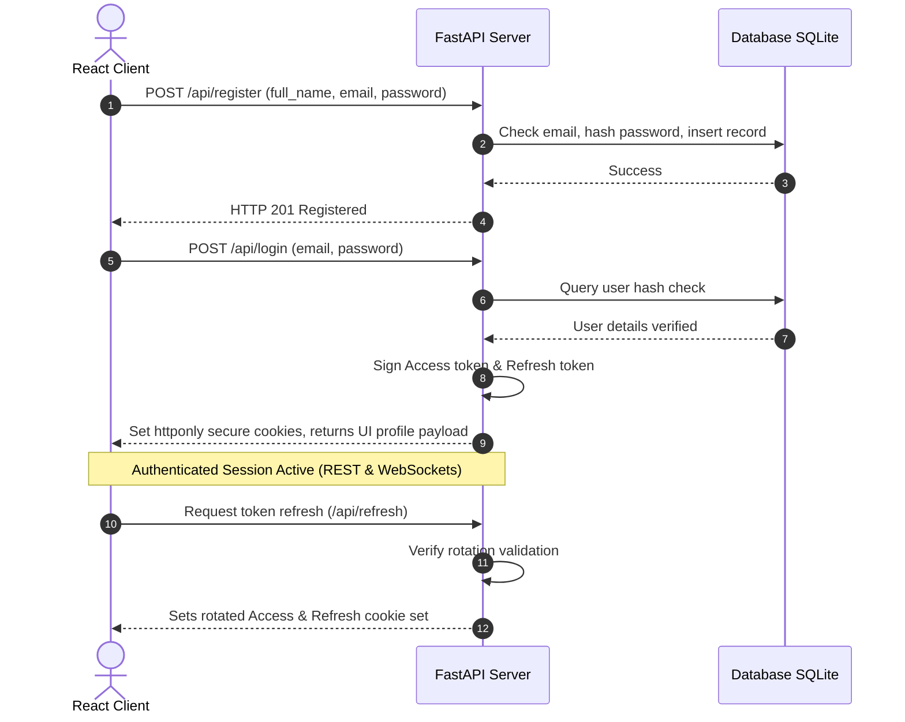
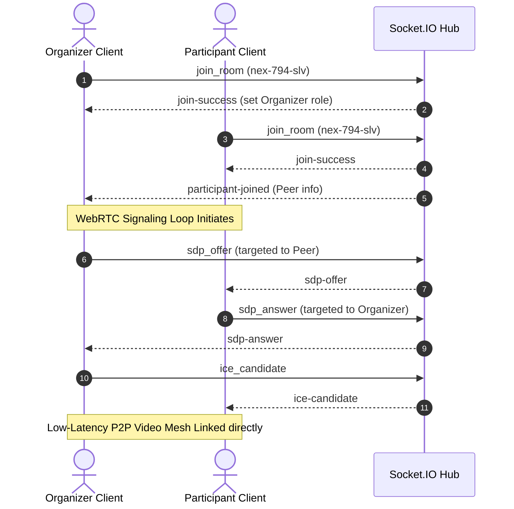

# 🪐 Nexus — Where Every Voice Matters

<p align="center">
  
</p>

<p align="center">
  
</p>

<h1 align="center">NEXUS</h1>

<p align="center">
  <strong>Where Every Voice Matters.</strong>
</p>

<p align="center">
  Nexus is a next-generation, self-hosted, AI-powered online meeting and real-time collaboration platform. Designed for modern software engineering teams, startup founders, and privacy-conscious organizations, Nexus combines low-latency WebRTC group sessions with real-time AI transcription, live multilingual translations, smart collaborative whiteboard drawings, and a semantic memory index for searching meeting history.
</p>

<p align="center">
  
  
  
  
  
  <br />
  
  
  
  
  
</p>

<p align="center">
  <a href="https://git.io/typing-svg">
    
  </a>
</p>

---

## 📑 Table of Contents

- [📸 Screenshots](#-screenshots)
- [🎯 Project Overview](#-project-overview)
- [✨ Core Features](#-core-features)
- [📊 Feature Comparison](#-feature-comparison)
- [🛠️ Technology Stack](#-technology-stack)
- [📐 System Architecture](#-system-architecture)
- [🔄 Project Workflow](#-project-workflow)
- [📁 Folder Structure](#-folder-structure)
- [🚀 Installation](#-installation)
- [⚙️ Environment Variables](#%EF%B8%8F-environment-variables)
- [🔌 API Overview](#-api-overview)
- [🗄️ Database Schema](#%EF%B8%8F-database-schema)
- [🔑 Authentication Flow](#-authentication-flow)
- [📞 Meeting Workflow](#-meeting-workflow)
- [🤖 AI Features](#-ai-features)
- [⚡ Performance Optimizations](#-performance-optimizations)
- [🔒 Security](#-security)
- [📦 Deployment](#-deployment)
- [🗺️ Roadmap](#%EF%B8%8F-roadmap)
- [🤝 Contributing](#-contributing)
- [📄 License](#-license)
- [👨‍💻 Author](#-author)

---

## 📸 Screenshots

### 🏠 Landing Page
> [!NOTE]
> Futuristic monochrome dark-mode homepage with full pricing breakdowns, comprehensive platform comparisons, and automated FAQ accordions.
<p align="center">
  
</p>

### 📊 User Dashboard
> [!NOTE]
> Real-time aggregates showing meeting histories, personal analytics (average ping metrics, total durations, active hosts count), and profile configuration portals.
<p align="center">
  
</p>

### 🎙️ Meeting Room
> [!NOTE]
> Low-latency WebRTC mesh rendering video nodes side-by-side with real-time transcription channels, shared board sketches, and floating reactions.
<p align="center">
  
</p>

### 👤 User Profile
> [!NOTE]
> User customization page displaying display names, active email nodes, presets, and customized configuration settings.
<p align="center">
  
</p>

---

## 🎯 Project Overview

### The Problem
Traditional meeting solutions (Zoom, Google Meet, Teams) are locked SaaS monoliths. They operate on closed clouds, offer weak post-meeting value extraction, and collect metadata on private corporate negotiations. Finding a specific decision or task assigned during a call last week involves skimming through hours of manual video recordings.

### The Solution
Nexus bridges the gap between secure WebRTC signaling and generative AI. It is structured to run locally or self-hosted in seconds. Instead of raw video archives, Nexus processes transcripts locally or via private models, generating smart action points, key decisions, and enabling semantic search across past conferences.

* **Vision**: Redefine video negotiations by making the content of meetings structured, queryable, and automated.
* **Mission**: Deliver a low-overhead, exceptionally polished, self-hosted conference node containing cutting-edge WebRTC architectures and AI assistance.

---

## ✨ Core Features

| Feature Area | Sub-Feature | Detailed Capability |
| :--- | :--- | :--- |
| **Authentication** | Secure JWT Auth | FastAPI backend signing Access and Refresh Tokens with strict cookie flags. In-memory rate limiting shields credentials endpoints. |
| **Meeting System** | Low-latency WebRTC | Real-time audio/video streaming via fully managed peer-to-peer WebRTC mesh signaling. |
| | Host Admin Controls | Lock conference rooms, enable waiting lobbies, mute participants globally, or kick users instantly. |
| | Collaborative Whiteboard | Drawing canvas with color selection, brush widths, and AI diagram cleanup blocks. |
| | Interactive Tools | Live polls creation/voting, instant text chat with markdown/code blocks rendering, and document sharing. |
| **AI Copilot** | Transcript Highlights | Live transcripts feed generating automatically identified Decisions and Action Items in real-time. |
| | Smart Noteify | Condense transcripts into structured markdown minutes (MOM) instantly. |
| | Live Translations | Instant Japanese, Spanish, German, and Hindi transcript translation. |
| | Nexus Memory™ Search | Semantic queries using Gemini API embeddings to search past meeting statements and context. |
| **User Workspace** | Interactive Dashboard | Unified panel containing telemetry metrics, analytics graphs, and settings customizers. |

---

## 📊 Feature Comparison

| Feature | Nexus | Traditional Cloud Platforms (Zoom/Meet) |
| :--- | :--- | :--- |
| **AI Semantic Search** | **Yes (Nexus Memory™)** | No (Requires external plugin/addon) |
| **Data Privacy** | Fully Self-Hosted / SQLite | Managed Cloud (Data harvested for model training) |
| **Whiteboard AI Cleanup** | **Yes** | Standard sketch lines only |
| **Live Local Translation** | **Yes (Built-in translation engine)** | Paid tiers or enterprise addons only |
| **Pricing** | Free & Open Source | High monthly subscription costs |
| **JWT Rotation & Security** | Yes | Closed Proprietary OAuth |

---

## 🛠️ Technology Stack

### Frontend Architecture
* **Core Framework**: React 19 (TypeScript)
* **Styling**: Vanilla CSS, TailwindCSS (for utility layout structure)
* **State Management**: React Context API (`AuthContext`, `ToastContext`)
* **Animations**: Framer Motion (page transitions, sidebar expand, reaction overlays)
* **Real-time Comms**: Socket.IO Client, HTML5 WebRTC `RTCPeerConnection`

### Backend Service
* **API Service**: FastAPI (Python 3.10+)
* **Database Driver**: SQLAlchemy (ORM layer)
* **Real-Time Gateway**: python-socketio (WebSocket namespace)
* **Authentication**: PyJWT (ECDSA/RSA JWT rotation), passlib (bcrypt password hashing)
* **AI Embeddings**: Google Generative AI (Gemini model API)

### Database System
* **Primary Store**: SQLite (single-file serverless storage, highly optimized for self-hosting)

---

## 📐 System Architecture

Nexus uses a decoupled architecture where the React frontend communicates over both HTTP REST endpoints (for auth, settings, profiles) and high-throughput WebSockets (for WebRTC signaling, chats, whiteboard, live transcriptions).



---

## 🔄 Project Workflow

This flowchart outlines the lifecycle of a typical conference session from sign-in to AI analysis:



---

## 📁 Folder Structure

```
├── backend/                  # FastAPI Backend Server Source
│   ├── auth.py               # Password hashing & JWT signature verification
│   ├── config.py             # Environment configurations
│   ├── database.py           # SQLAlchemy SQLite Models & DB initializations
│   └── main.py               # REST Endpoints, Rate limits & Socket.IO events
├── src/                      # React Frontend Source
│   ├── components/           # Component Tree
│   │   ├── meeting/          # Modular Meeting Room Decomposed Components
│   │   │   ├── AIPanel.tsx          # Real-time transcribing log & highlight blocks
│   │   │   ├── ChatPanel.tsx        # Instant chat panel
│   │   │   ├── FilesPanel.tsx       # Document attachments portal
│   │   │   ├── MeetingControls.tsx  # Bottom floating toolbar controls
│   │   │   ├── MeetingHeader.tsx    # Header telemetry status UI
│   │   │   ├── NotesPanel.tsx       # Shared text notes
│   │   │   ├── ParticipantGrid.tsx  # WebRTC adaptive grid layouts
│   │   │   ├── ParticipantsPanel.tsx# Organizer settings panel
│   │   │   ├── PollsPanel.tsx       # Poll creator & vote progress
│   │   │   ├── PostMeetingScreen.tsx# Analytics summary page
│   │   │   └── types.ts             # Shared type interfaces
│   │   └── ui/               # Reusable UI Blocks
│   │       └── CommandPalette.tsx   # Global Cmd+K / Ctrl+K palette searcher
│   ├── context/              # Global React contexts (AuthContext, ToastContext)
│   ├── hooks/                # Custom WebRTC & Socket hooks
│   ├── pages/                # Router Page components (Dashboard, History, etc.)
│   ├── App.tsx               # Main Application Router & Shell
│   ├── index.css             # Glassmorphic Dark UI design tokens
│   └── main.tsx              # Application entry point
├── assets/                   # Static icons and logos
├── vite.config.ts            # Rollup chunks-split configuration
├── tsconfig.json             # TypeScript settings
└── package.json              # Frontend dependency specs
```

---

## 🚀 Installation

Follow these steps to run Nexus in a local development environment.

### Prerequisites
* **Python 3.10+** (check using `python --version`)
* **Node.js 18+** (check using `node --version`)

### Step 1: Clone the Repository
```bash
git clone https://github.com/your-username/nexus.git
cd nexus
```

### Step 2: Set Up Backend
Initialize a Python virtual environment and install the required modules:
```bash
# Create virtual environment
python -m venv venv

# Activate virtual environment
# On Windows:
.\venv\Scripts\activate
# On macOS/Linux:
source venv/bin/activate

# Install requirements
pip install fastapi uvicorn sqlalchemy python-socketio pyjwt passlib[bcrypt] python-multipart google-generativeai
```

### Step 3: Set Up Frontend
Install the client dependencies:
```bash
npm install
```

### Step 4: Configure Environment Variables
Create a file named `.env` in the root directory (refer to the [Environment Variables](#%EF%B8%8F-environment-variables) section below for variables detail):
```bash
# In the project root folder
cp .env.example .env
```

### Step 5: Start the Platform

Start the Backend Server (Port 8000):
```bash
python -m uvicorn backend.main:asgi_app --host 0.0.0.0 --port 8000 --reload
```

Start the Frontend Web Application (Port 5173):
```bash
npm run dev
```

Visit the application at `http://localhost:5173`.

---

## ⚙️ Environment Variables

A `.env` file should be placed in the project root path. Here is the configuration breakdown:

| Environment Variable | Default Value | Description |
| :--- | :--- | :--- |
| `DATABASE_URL` | `sqlite:///./nexus.db` | Connection URI for SQLAlchemy database models. |
| `JWT_SECRET_KEY` | *Auto-generated on launch if empty* | High-entropy string used to sign secure authentication tokens. |
| `ACCESS_TOKEN_EXPIRE_MINUTES` | `30` | Duration (in minutes) for which access tokens are validated. |
| `GEMINI_API_KEY` | *Optional* | API key for Google Generative AI to enable **Nexus Memory™** semantic search. |
| `APP_URL` | `http://localhost:5173` | The public URL of the React client interface. Used to lock CORS headers. |

---

## 🔌 API Overview

### Authentication System
* `POST /api/register` — Register a new account.
* `POST /api/login` — Login (returns Access/Refresh tokens in httponly cookies).
* `POST /api/refresh` — Silent token rotation endpoint.
* `POST /api/logout` — Revokes cookies and sessions.

### User Profiles
* `GET /api/user/profile` — Fetch display name and email configuration.
* `PATCH /api/user/profile` — Update username or select avatar color gradients.

### Meeting Registry
* `POST /api/meetings` — Reserve a meeting code room.
* `GET /api/meetings/{room_code}` — Audit lock, waitlist settings.
* `GET /api/meetings/history` — Fetch paginated user conference history.

### AI & Search (Nexus Memory™)
* `POST /api/memory/search` — Vector semantic search over user's meeting archives.
* `POST /api/upload` — Multipart form uploader for file attachment storage.

---

## 🗄️ Database Schema

Here is the database entity relational structure mapped via SQLAlchemy ORM models:



---

## 🔑 Authentication Flow

Nexus implements a JWT token rotation flow where token security rules are enforced on both endpoints.



---

## 📞 Meeting Workflow

This sequence handles low-latency WebRTC connection initialization using the central signaling WebSocket:



---

## 🤖 AI Features

### Real-Time Transcription & Translation
Nexus captures user speech feeds and produces real-time transcription texts. If Translation mode is selected (Japanese, Spanish, German, Hindi), the live transcript line is processed instantly, feeding translation text under the video node grids.

### Nexus Memory™ Search
* Powered by Google's Gemini text-embeddings API endpoint.
* Summarizes and saves chat segments under structured database types (`MeetingMemory` table).
* Enables semantic search matches: searching *"security decision"* matches sentences like *"we decided to implement AES-256 for socket transport"* even if the exact keyword "security" was never used in the message.

---

## ⚡ Performance Optimizations

* **Vite Rollup Manual Chunks**: Code split into optimized modules to avoid large single bundle deliveries:
  * `chunk-meeting.js`: Decomposed video grid panels and whiteboard layers.
  * `vendor-react.js`: Core React 19 libraries.
  * `vendor-motion.js`: Heavy animation framer-motion layers.
* **Stream Optimization**: Disabling screen-shares, camera feeds, or muting participants terminates media tracks immediately, releasing hardware processors.
* **Drawing Canvas Debounce**: Whiteboard drawing lines use custom coordinate smoothing algorithms to minimize drawing coordinate transfers over socket channels.

---

## 🔒 Security

* **Secure Auth Cookies**: JWT tokens are signed using high-entropy secret keys and stored inside `HTTPOnly`, `Secure`, and `SameSite=Lax` cookie parameters to protect against Cross-Site Scripting (XSS) and CSRF attacks.
* **Backend Rate Limiting**: Limit authentication endpoints to `5 requests / minute` in-memory to prevent automated brute-force attempts.
* **CORS Policies**: Explicit origin validation matching client domains:
  ```python
  allow_origins=[os.getenv("APP_URL", "http://localhost:5173")]
  ```

---

## 📦 Deployment

### Frontend (Static SPA Host)
Build the frontend distribution files:
```bash
npm run build
```
Upload the compiled `./dist/` directory directly to Vercel, Netlify, Cloudflare Pages, or an AWS S3 bucket.

### Backend (Server Host)
Deploy to Render, Railway, fly.io, or an AWS EC2 instance. Ensure Python requirements are installed and configure standard systemd uvicorn listeners.

---

## 🗺️ Roadmap

- [x] Full page routing migration to React Router v6.
- [x] Monolithic `MeetingRoom.tsx` decomposition.
- [x] Command Palette implementation.
- [x] Rate limits & refresh token rotations.
- [ ] Implement coturn server mappings for real-world stun/turn video mesh routings.
- [ ] Connect PostgreSQL adapter layers.
- [ ] Native Electron applications wrappers.

---

## 🤝 Contributing

We welcome contributions from the community!

1. Fork the repository.
2. Create your feature branch (`git checkout -b feature/amazing-feature`).
3. Commit your changes (`git commit -m 'Add some amazing feature'`).
4. Push to the branch (`git push origin feature/amazing-feature`).
5. Open a Pull Request.

Please ensure TypeScript configurations and tests pass successfully before committing code changes.

---

## 📄 License

Distributed under the MIT License. See `LICENSE` for more information.

---

## 👨‍💻 Author

### Sreehari
* **Role**: Senior Software Engineer & Platform Architect
* **GitHub**: [@sreehriz](https://github.com/sreehriz)
* **LinkedIn**: [linkedin.com/in/sreehriz](https://linkedin.com/in/sreehriz)
* **Portfolio**: [sreehriz.dev](https://sreehriz.dev)

---

<p align="center">
  ⭐ <strong>Star this repository if you enjoyed Nexus!</strong>
</p>
