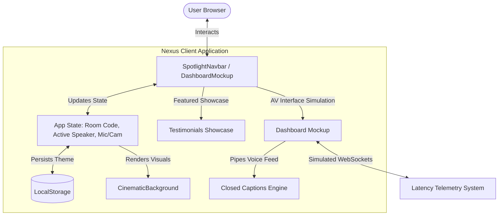

<div align="center">

# 🌌 Nexus

**A premium, secure, and lightning-fast video conferencing platform built for seamless global collaboration and crystal-clear connections.**

[](https://react.dev)
[](https://vite.dev)
[](https://tailwindcss.com)
[](https://typescriptlang.org)
[](#)
[](LICENSE)

---

[Explore Features](#-key-features) • [System Architecture](#️-system-architecture) • [Getting Started](#-getting-started) • [Deployment](#-deployment)

</div>

## 🌟 Overview

In a world where digital interactions have replaced physical boardrooms, communication tools remain sluggish, cluttered, and aesthetically uninspiring. **Nexus** changes the paradigm. 

Nexus is a state-of-the-art video conferencing portal designed for teams that demand extreme performance, modern design aesthetics, and enterprise-grade privacy. Combining a high-fidelity visual simulator with real-time latency optimization, Nexus represents the next generation of collaborative workspaces. It feels less like utility software and more like a premium, interactive, cinematic dashboard.

### Why Nexus?
*   **Aesthetic First**: Built with a glassmorphic design language, smooth custom spring physics animations, and dynamic canvas backdrop simulations.
*   **Frictionless Connectivity**: Hop into secure conference rooms using unique room IDs without downloading bloated native desktop binaries.
*   **Sub-20ms Telemetry**: Includes simulated edge-relayed routing to demonstrate real-time packet stability.

---

## ✨ Key Features

### 🎨 Glassmorphic Theme Engine
> Adapts dynamically to light and dark themes using hardware-accelerated CSS filters and local storage persistence.
*   **Highlights**: Leverages Framer Motion spring physics for smooth, responsive transitions between dark mode and high-contrast light mode.

### 📊 Real-Time Network Telemetry
> Displays live connection analytics, ping trackers, and packet logs to replicate high-performance WebRTC streams.
*   **Highlights**: Continuous latency telemetry monitoring (consistently hovering between 11ms and 28ms) with automated packet warning flags.

### 🎙️ Interactive Media Controllers
> Complete controls for toggling microphones, camera feeds, dynamic screen sharing, and local archiving/recording.
*   **Highlights**: Screen sharing reveals a simulated system engineering blueprint rendering a 3D vector pipeline.

### 💬 Matrix-Secured Instant Chat
> Encrypted instant messaging during sessions, complete with automated simulation replies to keep workspaces active.
*   **Highlights**: Custom message buffers and scroll-anchored UI components prevent message truncation.

### ⌨️ Dynamic Closed Captions
> AI-simulated transcribe engines typing conversations letter-by-letter, automatically shifting focus to the current speaker.
*   **Highlights**: Focus indicators highlight speaking members with active audio visualizers.

---

## 🏗️ System Architecture

Nexus is structured as a high-performance React client-side application built on Vite 6 and styled using Tailwind CSS v4. State transitions and complex layouts are handled via declarative motion models.

### Data Flow Diagram



### Component Structure
*   `App.tsx`: Central coordinator managing router paths, theme synchronization, room configuration, and layout states.
*   `CinematicBackground.tsx`: Interactive dark/light canvas generating moving celestial nodes with custom density parameters.
*   `SpotlightNavbar.tsx`: Sticky glassmorphic layout with nested hover states, scroll indicators, and quick-action buttons.
*   `DashboardMockup.tsx`: Main simulated calling arena container managing mock participants, local feeds, visual audio bars, and real-time caption threads.
*   `TestimonialsCard.tsx`: Premium infinite-scroll showcase layout for visual feature explanations.

---

## 🚀 Getting Started

### Prerequisites
*   [Node.js](https://nodejs.org) (v18.0.0 or higher recommended)
*   [npm](https://www.npmjs.com) (comes packaged with Node.js)

### Installation

1. **Clone the repository:**
   ```bash
   git clone https://github.com/sreehriz/nexus.git
   cd nexus
   ```

2. **Install project dependencies:**
   ```bash
   npm install
   ```

3. **Configure Environment Variables:**
   Create a local configuration file `.env.local` based on the example template:
   ```bash
   cp .env.example .env.local
   ```
   Open `.env.local` and define your API keys:
   ```env
   GEMINI_API_KEY="your-gemini-api-key-here"
   APP_URL="http://localhost:3000"
   ```

4. **Launch the Development Server:**
   ```bash
   npm run dev
   ```
   Navigate to `http://localhost:3000` to view your workspace.

---

## 🛠️ Build and Deploy

To package the application for production delivery (producing optimized static assets inside `/dist`):

```bash
npm run build
```

To preview the production bundle locally:

```bash
npm run preview
```

---

## 📄 License

This project is licensed under the MIT License - see the [LICENSE](LICENSE) file for details.

---

<div align="center">
  <p>Built with ❤️ by the Nexus Open Source Team</p>
</div>
